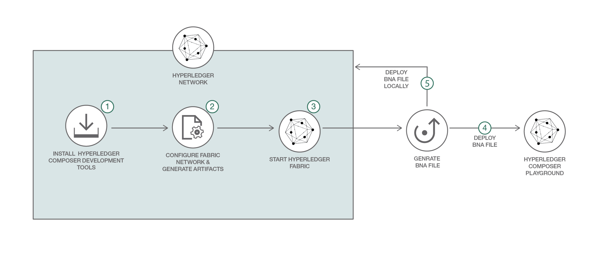

# BlockchainPublicRegulationFabric-Food

In this journey, we capture the regulatory compliance logic for the Food Supplier Verification Program in a smart contract deployed on a business network.

This business network defines:

**Participants:**
`Supplier` `Importer` `Retailer` `Regulator`

**Assets:**
`ProductListingContract`

**Transactions:**
`createProductListing` `transferListing` `checkProducts` `updateExemptedList`

Initially, the supplier will transfer the food products to an importer who verifies whether the supplier, country, and food type all match with the correct identifiers. At port of entry, the supplier is checked against a list of known suppliers in a database (managed by the regulator). If the supplier is of type exempt, then the products are then transferred to the retailer. If the supplier is of type non-exempt, then the products are checked against a list of known food products in the database (managed by the regulator). If the food is exempt product then transfer it to the retailer. If the food is a non-exempt product, the importer must conduct a harms analysis (either independently, or using a third-party). The supplier provides the harms analysis report to the regulator. The regulator reviews compliance attestation and transfers the products to the retailer.

The `createProductListing` function is called when an `createProductListing` transaction is submitted. The logic allows a supplier to create a `ProductListingContract` asset.

The `transferListing` function is called when a `transferListing` transaction is submitted by the owner of `ProductListingContract`. It is submitted either by `Supplier` to transfer `ProductListingContract` to `Importer` or by `Importer` to transfer `ProductListingContract` to `Retailer` when the exempt check for the products is completed.

The `checkProducts` function is called when a `checkProducts` transaction is submitted by the `Supplier` to perform the exempt check for the products present in the `ProductListingContract`. The status of `ProductListingContract` contract will change to `CHECKCOMPLETED` if all all the products are exempted else the status will change to `HAZARDANALYSISCHECKREQ`. `HAZARDANALYSISCHECKREQ` means the `Supplier` needs to provide Hazard Analysis report for the products. After submitting the report `Supplier` performs the `checkProducts` transaction to complete the exempt check for the products.

The `updateExemptedList` function is called when a `updateExemptedList` transaction is submitted by the `Regulator` to update the list of exempted Orgs ids and Product ids.

Audience level : Intermediate Developers

If you have an IBM cloud lite account, you can also use the free version of the Blockchain Platform 2.0 for this pattern.

## Included Components
* Hyperledger Fabric (Blockchain)
* Kubernetes

## Application Workflow Diagram


* Install Hyperledger Fabric development tools
* Configure and start Hyperledger Fabric network
* Use Fabric SDK to enroll user and invoke blockchain transactions

Flow:
1. Deploy Hyperledger network as group of Docker containers (Kubernetes if hosted)
2. Install smart contracts on Hyperledger containers
3. Express backend uses Fabric SDK to create and enroll blockchain user
4. User submits transactions through Vue UI
5. Vue UI forwards requests to Express backend, which executes requests on the ledger with Fabric SDK
6. Ledger state is retrieved by SDK and displayed in Vue UI

## Install Prerequisites:

### IBM Cloud CLI
To interact with the hosted offerings, the IBM Cloud CLI will need to be installed beforehand. The latest CLI releases can be found at the link [here](https://console.bluemix.net/docs/cli/reference/bluemix_cli/download_cli.html#download_install). An install script is maintained at the mentioned link, which can be executed with one of the following commands

```bash
# Mac OSX
curl -fsSL https://clis.ng.bluemix.net/install/osx | sh

# Linux
curl -fsSL https://clis.ng.bluemix.net/install/linux | sh

# Powershell
iex(New-Object Net.WebClient).DownloadString('https://clis.ng.bluemix.net/install/powershell')
```
After installation is complete, confirm the CLI is working by printing the version like so

```bash
ibmcloud -v
```

```bash
# Log in
ibmcloud login
```

Finally, install the container service plugin. This plugin allows us to communicate with the IBM Cloud container service and provision a Kubernetes cluster. Kubernetes is used here to host the application and blockchain network.

```bash
ibmcloud plugin install container-service -r Bluemix
```

### Kubernetes CLI

We'll also need to install the kubectl CLI to deploy the application on the provisioned Kubernetes cluster. This requires a configuration file specifying information for each container, such as the base docker image, exposed ports, default command, etc.
```bash
# OS X
curl https://storage.googleapis.com/kubernetes-release/release/v1.11.7/bin/darwin/amd64/kubectl -P /usr/local/bin/
# Linux
curl https://storage.googleapis.com/kubernetes-release/release/v1.11.7/bin/linux/amd64/kubectl -P /usr/local/bin/

chmod +x /usr/local/bin/kubectl
kubectl -v
```

<!-- # Windows
curl https://storage.googleapis.com/kubernetes-release/release/v1.11.7/bin/windows/amd64/kubectl.exe -->

### Node.js packages

If expecting to run this application locally, please install [Node.js](https://nodejs.org/en/) and NPM. Currently the Hyperledger Fabric SDK only appears to work with node v8.9.0+, but [is not yet supported](https://github.com/hyperledger/fabric-sdk-node#build-and-test) on node v9.0+. If your system requires newer versions of node for other projects, we'd suggest using [nvm](https://github.com/creationix/nvm) to easily switch between node versions. We did so with the following commands

```bash
curl -o- https://raw.githubusercontent.com/creationix/nvm/v0.33.11/install.sh | bash
# Place next three lines in ~/.bash_profile
export NVM_DIR="$HOME/.nvm"
[ -s "$NVM_DIR/nvm.sh" ] && \. "$NVM_DIR/nvm.sh"  # This loads nvm
[ -s "$NVM_DIR/bash_completion" ] && \. "$NVM_DIR/bash_completion"  # This loads nvm bash_completion
nvm install v8.9.0
nvm use 8.9.0
```

To run the Food Regulation UI locally, we'll need to install a few node libraries which are listed in our `package.json` file.
- [Vue.js](https://vuejs.org/): Used to simplify the generation of front-end components
- [Express.js](https://expressjs.org/): Used to provide custom api endpoints
- [Hyperledger Fabric SDK](https://fabric-sdk-node.github.io/): Enables backend to connect to IBM Blockchain service

### GoLang
Golang is a programming language we'll use to write "smart contracts". Smart contracts are essentially functions that can be used to query and update the ledger.

Golang can be installed by visiting the following [link](https://golang.org/dl/), and downloading the package for your operating system.

On OS X, we can install go by downloading and selecting the `.pkg` file, and click through the prompt. If using Linux, we can install go by downloading the `.tar.gz` file and extracting it to `/usr/local`

```
tar -C /usr/local -xzf go*tar.gz
```

By default, the "GOPATH" environment variable should be set to `$HOME/go`. Set this `GOPATH` variable in your `~/.bash_profile`.
```
GOPATH=$HOME/go
```

### VSCode
Visit the following [link](https://code.visualstudio.com/) to download Visual Studio code for your operating system.

Once VSCode is installed, follow the requirements [here](https://github.com/IBM-Blockchain/blockchain-vscode-extension/blob/master/README.md#requirements) to install the IBM Blockchain Platform extension.

## Steps
1. [Clone Git Repository](#1-clone-git-repository)
2. [Package Smart Contract](#2-deploy-the-blockchain-network)
3. [Deploy local Blockchain Network](#3-deploy-a-blockchain-network)
4. [Start Node server](#4-deploy-node-application)
5. [Populate Ledger and Simulate Transactions](#5-populate-ledger-and-simulate-transactions)

## 1. Clone Git Repository
```
git clone https://github.com/IBM/BlockchainPublicRegulationFabric-Food/
```

## 2. Package Smart Contract

We'll interact with VSCode via a graphic interface. If you're running on Linux or a headless operating system, or would prefer to manage the network manually via shell scripts, please skip ahead to the section labelled "Local Scripts".

These smart contracts are written in Golang, so the source code for the smart contracts will need to be copied to the src folder in your `GOPATH`. This can be done like so.
```
mkdir $GOPATH/src/github.com/food
cp chaincode/*go $GOPATH/src/github.com/food/
```

After this step, there should be several `.go` files in the directory, we can confirm with a `ls` command like so
```
Kalonjis-MacBook-Pro:~ kkbankol@us.ibm.com$ ls $GOPATH/src/github.com/food
foodSupply.go	lib.go		read_ledger.go	write_ledger.go
```

- Open VS Code

- In the menu, Click "File" and then "Open" (Or press CMD + O). Navigate to the directory where your `GOPATH` directory is set (this should default to `~/go`), and select the directory at `$GOPATH/src/github.com/food`


- Press "F1", and choose the option "IBM Blockchain Platform: Package a Smart Contract Project"


- Enter a name and version. Here we'll use "food" and "1.0".

- Select the "IBM Blockchain Platform" button on the left hand menu

- In the "Smart Contract Packages" section, right click on the newly generated smart contract, and then click "export" to save the generate chaincode as a `.cds` file. Keep note of the directory, as we'll need to reference it later.


## 3. Deploy a Blockchain Network


- If you get errors like the gRPC error, you may need to download an earlier version of VSCode (1.39) [here](https://code.visualstudio.com/updates/v1_39). Note that if you are using Mac, make sure the VSCode in your /Applications
folder shows version 1.39 when you click on show details. You may need to 
move newer version into the trash, and then empty the trash for the older 
version to work.

- First, we need to go to our IBM Blockchain Extension. Click on the IBM Blockchain icon
  in the left side of VSCode (It looks like a square). 
- Next, start your local fabric by clicking on 
  *1 Org Local Fabric* in the **FABRIC ENVIRONMENTS** pane.
  
- Once the runtime is finished starting (this might take a couple of minutes), under *Local Fabric* you should see *Smart Contracts* and a section for both *installed* and *instantiated*.

### Install and Instantiate Contract
**🚨🚨Note the gifs show a different smart contract name being instantiated, but the process is the same🚨🚨**

- Next, we have to import our contract before we can install it. Click on 
**View -> Open Command Pallette -> Import Smart Contract**. Next, click 
on the `food@0.0.1.cds` file that is at the root of our directory.
This will be where you cloned this repo.


- Now, let's click on *+ Install* and choose the peer that is available. Then the extension will ask you which package to 
 install. Choose *food@0.0.1.cds*.
- Lastly, we need to instantiate the contract to be able to submit transactions 
on our network. Click on *+ Instantiate* and then choose *food@0.0.1.cds*.
- When promted for a function, a private data collection, or and endorsement 
policy, hit `enter` on your keyboard, which will take all of the defaults.
- This will instantiate the smart contract. This may take some time. You should see the contract under the *instantiated* tab on the left-hand side, once it 
is finished instantiating.

*Local Scripts*

As an alternative to VSCode, we can also use the Hyperledger fabric scripts to provision a network like so.
```
cd local
./startFabric.sh

# confirm hyperledger containers are up and running
docker ps
```

Next, we'll need to install the "Smart Contracts" / "Chaincode", which are a series of functions that have the ability to modify the ledger. This is done by copying the source code into the cli container, and then running `peer chaincode install` and `peer chaincode instantiate` to activate the chaincode.

```
./installChaincode.sh
```

The install script should result in the following output. Confirm that all status codes have the value of "200" and "OK"


After the chaincode has been installed, we can run a sample chaincode invocation to confirm things are configured properly. This can be done by using the `docker exec` command, and providing arguments to target our hyperledger network and invoke the `read_everything` function. This should return a 200 status code and a JSON object with `products`, `retailer`, and `regulator` keys.

```
docker exec cli peer chaincode invoke -o orderer.example.com:7050 -C mychannel -n food -c '{"Args":["read_everything"]}'
```

<!-- *Hosted* -->


## 4. Deploy Node Application

In this section, we'll leverage the Node.js Express and Vue frameworks to provide a user friendly way to interact with the Blockchain network.

### Backend
The backend uses the Hyperledger Fabric SDK to communicate with a blockchain network, which can be either local or hosted.

*Local*
Update `/etc/hosts` file with following entries
```
127.0.0.1 peer0.org1.example.com
127.0.0.1 ca.example.com
127.0.0.1 orderer.example.com
```

Enter backend directory, install dependencies, and start application with `npm start`. The `DEPLOY_TYPE=local` variable is only necessary when running against a local Hyperledger network. If this variable is not set, the credentials for a hosted blockchain service will need to be provided through the UI form.
```
cd ..
cd backend
npm install
PORT=30001 DEPLOY_TYPE=local npm start
```

<!-- *Hosted* -->

### Frontend

*Local*
```
cd ..
cd frontend
npm install
npm run serve
```

Visit the UI at `localhost:8080`

<!-- *Hosted* -->

## 5. Populate Ledger and Simulate Transactions
Initially the ledgerState will be blank. We can begin populating it with data by creating participants. To get the latest data from the ledger at any time, click the "Refresh Ledger" button.

Click the "Create User" button.

Select the "Supplier" type from a dropdown, and enter a Country and Org ID.


This will invoke a "init_user" function with the following data.

```
{
	id: "supplier1",
	type: "supplier",
	country: "US",
	orgId: "org1"
}
```

Repeat the "Create User" process for a Retailer, Importer, Supplier

Also click the "Create Regulator" button, and enter a unique ID to create a new Regulator.

Select the "Create Product" button, and fill out the form with a unique ID, quantity, and origin country.


Now, we can create a product listing. We'll do this by selecting "Create Product Listing", and providing a Listing ID and one or more product IDs. Also we'll need to specify a supplier ID, to specify the original creator of the listing.

After executing the transaction successfully, we should be able to click the "Refresh Ledger" button to see a table of the newly created listing. Since this is a new listing, we'll need to transfer it to a "Importer". This can be done with the "Transfer Product" button, and entering the ID of the listing and the new owner.


<!-- Picture -->

Once the transfer is complete, the listing status will change from `INITIALREQUEST`, to `EXEMPTCHECKREQ`, meaning a request will need to be submitted to have a Regulator check the products in the listing, and confirm that none of the products are from an exempted Organization or Country. If any of the Products are exempted, the listing state will be changed to `HAZARDANALYSISCHECKREQ`, and we'll be unable to transfer the listing to a retailer.


We can simulate an inspection by clicking on the "Check Products" button. This will render a form requiring the listing ID and a regulator ID. If this completes successfully, the product listing will change to `CHECKCOMPLETED`.


At this point, we can transfer the listing to a retailer using the "Transfer Listing" button.


This will update the Retailer product fields, and the Owner of the listing as seen below


## Troubleshooting

*Unable to start network through VSCode*
```
# change to directory where vscode plugins are installed
cd ~/.vscode/extensions/
cd ibmblockchain.ibm-blockchain-platform-*
cd basic-network
./start.sh

```
## Additional Resources
* [Hyperledger Fabric Docs](http://hyperledger-fabric.readthedocs.io/en/latest/)
* [Vue.js](https://vuejs.org/)

## License
This code pattern is licensed under the Apache Software License, Version 2. Separate third-party code objects invoked within this code pattern are licensed by their respective providers pursuant to their own separate licenses. Contributions are subject to the [Developer Certificate of Origin, Version 1.1 (DCO)](https://developercertificate.org/) and the [Apache Software License, Version 2](https://www.apache.org/licenses/LICENSE-2.0.txt).

[Apache Software License (ASL) FAQ](https://www.apache.org/foundation/license-faq.html#WhatDoesItMEAN)
